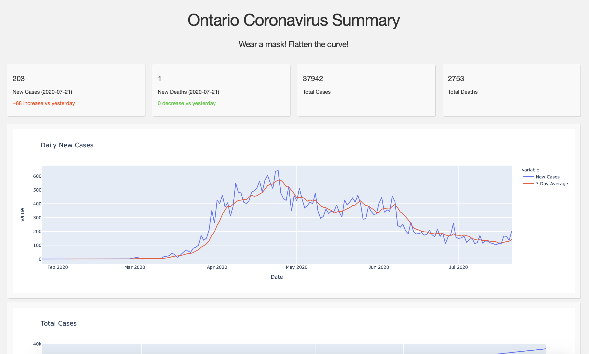

# COVID-19 Twitter Bot & Dashboard

## Dashboard
Dashboard utilizes the Plotly Dash library to create and present visualizations. Data is pulled from a Postgresql database that is updated daily.

## Twitter Bot
The bot queries data from the Government of Ontario's coronavirus API, formats the data, and sends a tweet via the Twitter API.

Daily updates occur at approximately 11:00AM EDT (UTC -4).

## Built With
Python, Flask, Dash, Tweepy, Peewee, Postgresql, Government of Ontario API, Twitter API

## Sources
[https://data.ontario.ca/organization/cabinet-office](https://data.ontario.ca/organization/cabinet-office)
